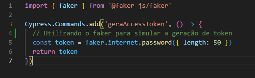
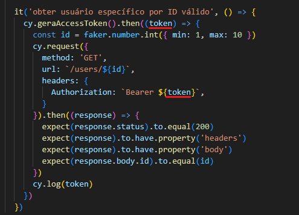
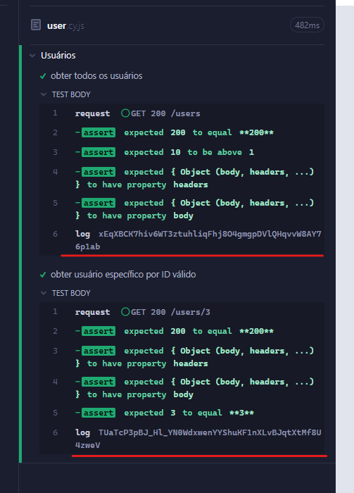

  # Gerando tokens para usar nas requests
  Sabe aqueles tokens que expiram e que de tempos em tempos precisamos gerá-los novamente? Pode ser que surja a dúvida de como podemos gerar esses tokens. A ideia desse projetinho simples é dar um exemplo de como podemos gerar tokens e utilizá-los em nossas requests com o Cypress.
  Bora lá!

  # Executando o projeto
  ## Pré-requisitos
  - É necessário ter o Node.js e o NPM instalados para executar o projeto.
  > Utilizei as versões v19.1.0 e 8.19.3, respectivamente

  ## Instruções
  1. Clone o projeto
  > git clone git@github.com:EderCuer/access_token.git
  2. Dentro da pasta, instale as dependências
  > npm install

  ## Executando o projeto
  Após a instalação das dependências, no terminal, execute `npm run cy:open`

  # Explicando
  ## cy.gerarAccessToken()
  No arquivo commands.js criei um comando que simula a geração de um `accessToken`, porque não achei uma API de teste que tenha esse tipo de token (caso alguém saiba me mande uma mensagem que eu atualizo o projeto). A ideia é mostrar como usar esse código gerado.
  

  ## Utilização do token
  Lembro que quando comecei a utilizar o Cypress eu tive muita dificuldade de entender algumas coisas. Eu tinha experiência com o Capybara (Ruby) e achava tudo no Cypress mais complicado e a primeira vez que fui trabalhar com a geração de token nada funcionava, só me estressei, mas depois de ajuda de um amigo tudo ficou mais claro para mim.
  
  Voltando... nessa solução que trouxe, quando formos usar o comando de gerar o token, utilizamos o .then() para usar o token que foi gerado via comando. Como podem ver no código abaixo, toda a request que fazemos está dentro dele e com isso conseguimos utilizar o token tranquilamente. Deixei um log ali para vermos o "token" que foi gerado.
  
  

  
